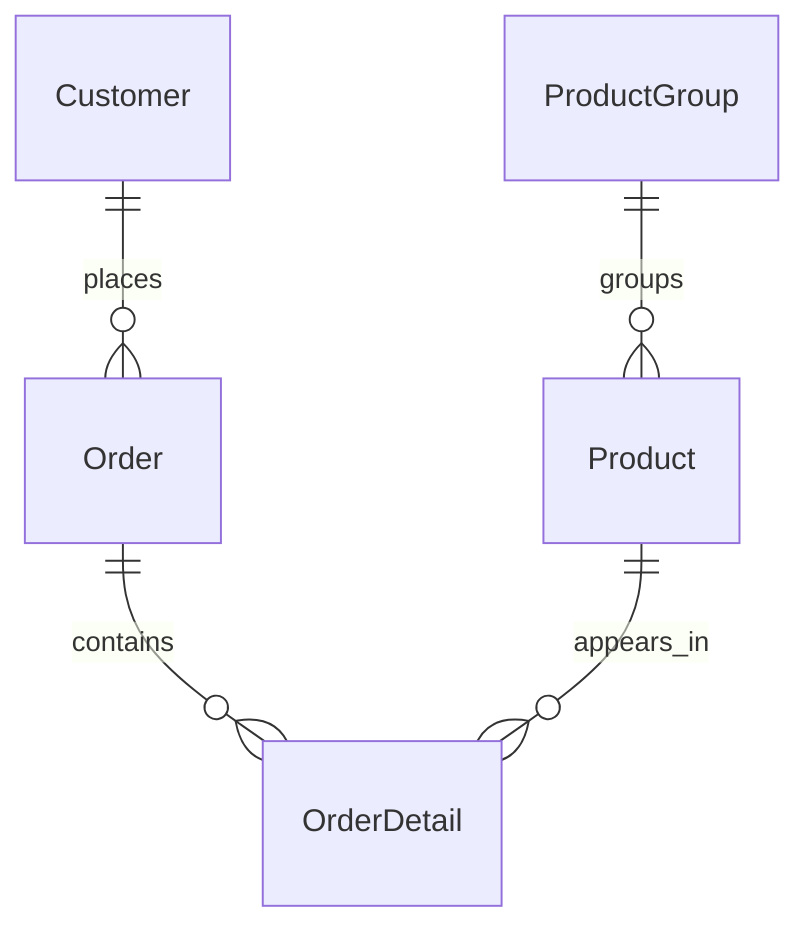
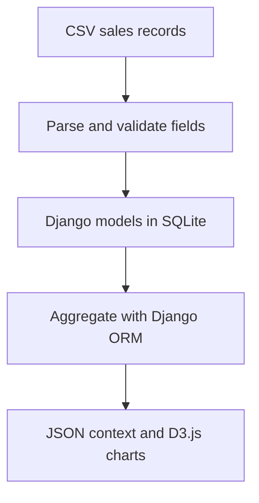

# Sales Data Model

Retrospective documentation based on `d3app/models.py` and the CSV importer.

| Entity | Purpose |
| --- | --- |
| Customer | Customer identifier, name and segment code |
| ProductGroup | Product-group code and label |
| Product | Product code, name, unit price and group |
| Order | Order identifier, customer and timestamp |
| OrderDetail | Product and quantity within an order |

## Rules visible in the current importer

- Identifiers are used to look up or create related records.
- A repeated order/product pair increments quantity.
- Revenue in the analytical view is calculated from quantity multiplied by the product unit price.
- Re-importing identical records is not safe for analytical totals without resetting or deduplicating the data.

## Potential improvements

Preserve transaction-level prices, separate import validation from insertion, add idempotency keys and test aggregates on a small hand-checked dataset. These are proposed improvements, not completed features.
